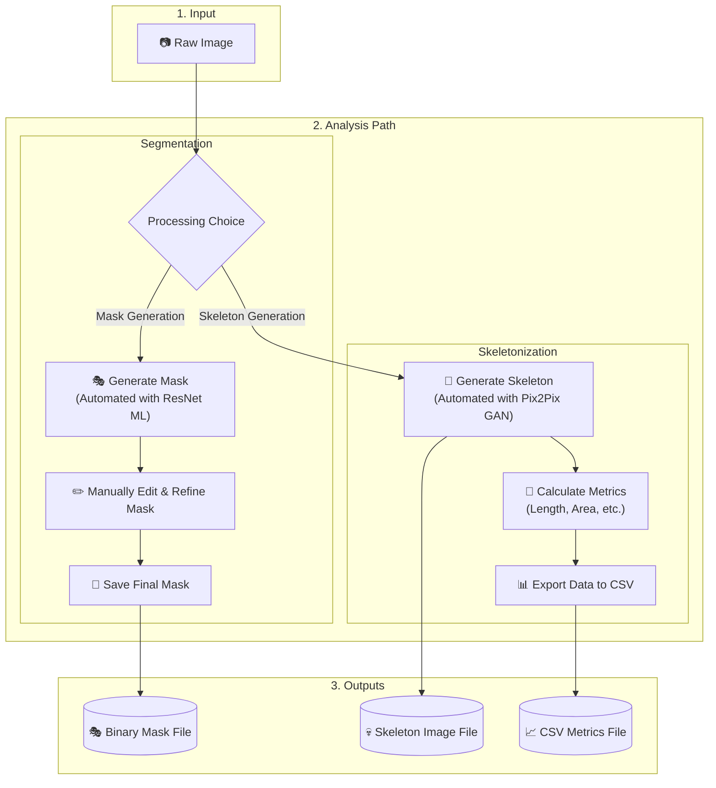
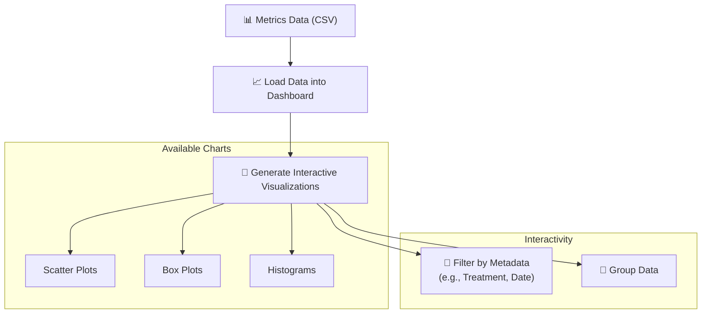
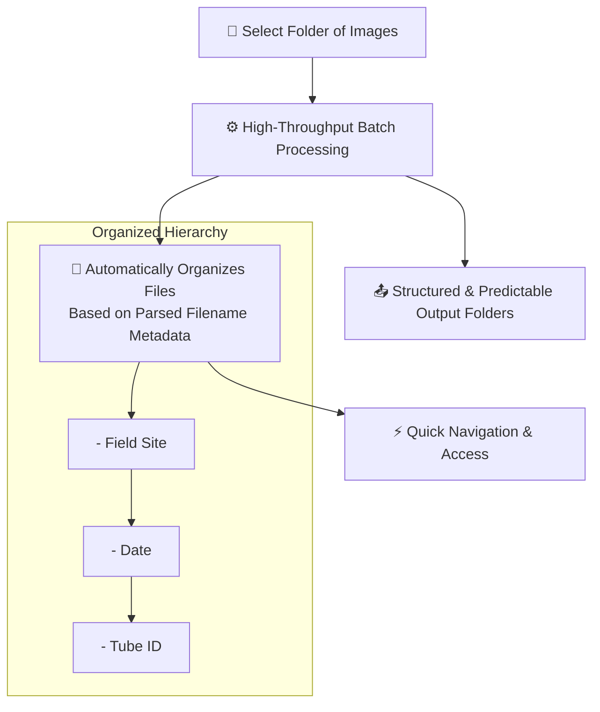
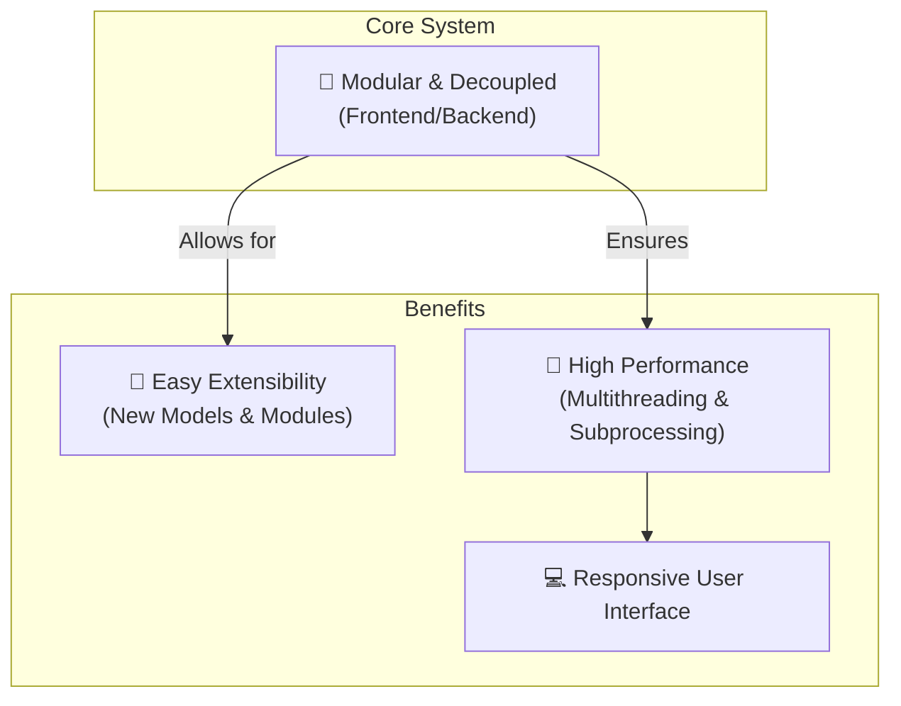

# Root Analysis Application: Features for Plant Biologists

This document outlines the key features of the Root-Mask-and-Skeletons (SPROUTS) application, specifically tailored to the needs of plant biologists conducting root analysis.

### I. Core Analysis Workflow

The application provides a powerful, end-to-end workflow for processing root images, from initial analysis to data export. You can choose to generate segmentation masks for area analysis or create detailed skeletons for morphometric measurements.

**Key Features:**
-   **Dual ML Models**: Employs a ResNet model for accurate segmentation and a Pix2Pix GAN for high-fidelity skeletonization.
-   **Interactive Editing**: Provides a full suite of tools (brush, eraser, fill) for fine-tuning ML-generated masks.
-   **Rich Data Export**: Exports calculated metrics to CSV for easy integration with external statistical analysis tools.

### II. Interactive Data Visualization

Once your root metrics are calculated, the application offers an integrated, interactive dashboard to explore and understand your results without leaving the application.

### III. Efficient Workflow and Data Management

Designed for high-throughput experiments, the application includes features to manage large datasets efficiently.

**Key Features:**
-   **Hierarchical Image Organization**: Parses filenames to create a navigable tree view, organizing images by metadata like field, date, and tube number.
-   **Hardware Optimization**: Intelligently utilizes available GPU (CUDA) for ML tasks to accelerate processing, with a seamless fallback to CPU.
-   **Intuitive UI**: A modern and user-friendly interface built with PyQt6.

### IV. Extensible and Performant Architecture

The application is built on a modular and performance-oriented architecture, ensuring it is both powerful and future-proof.

