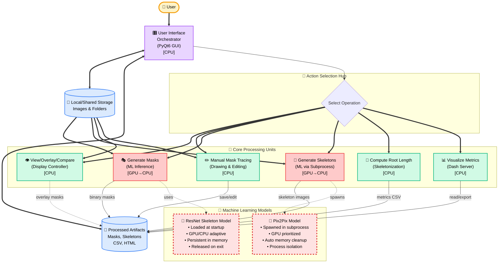
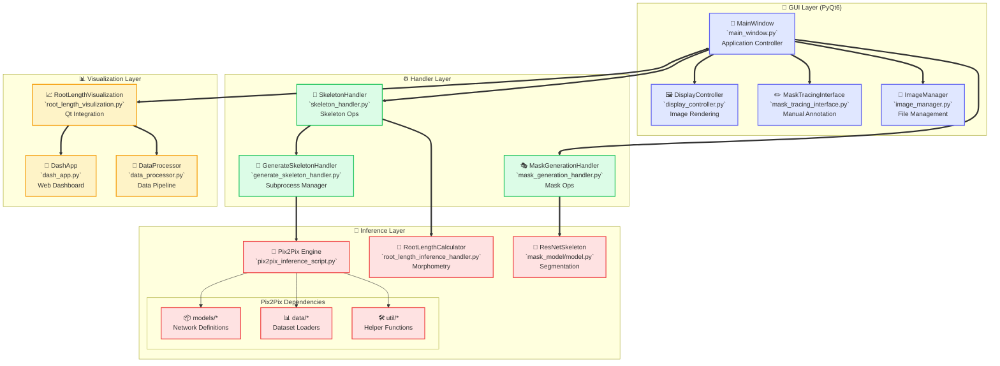
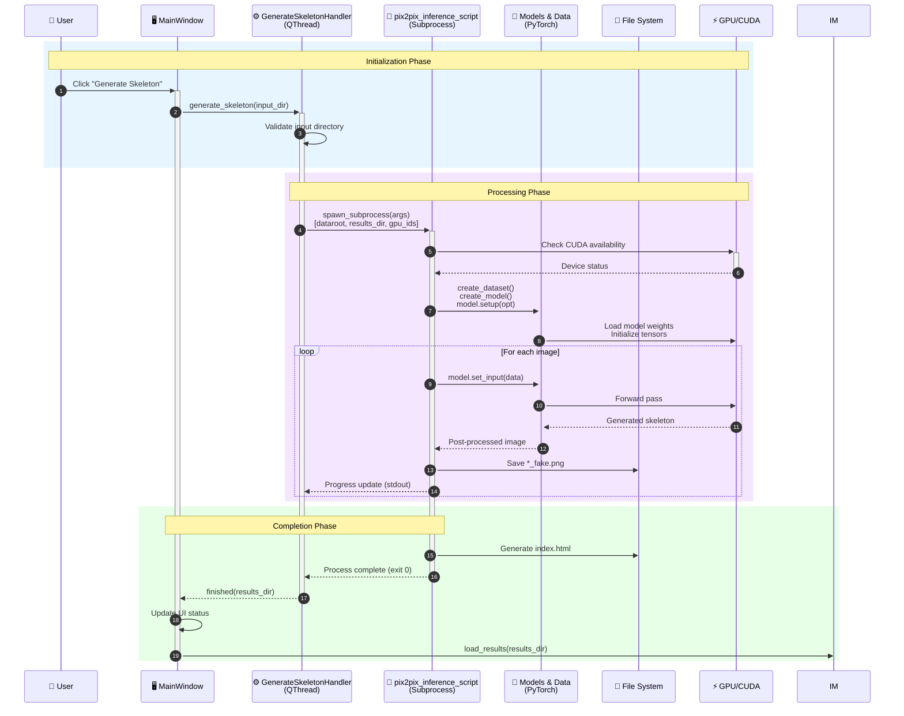
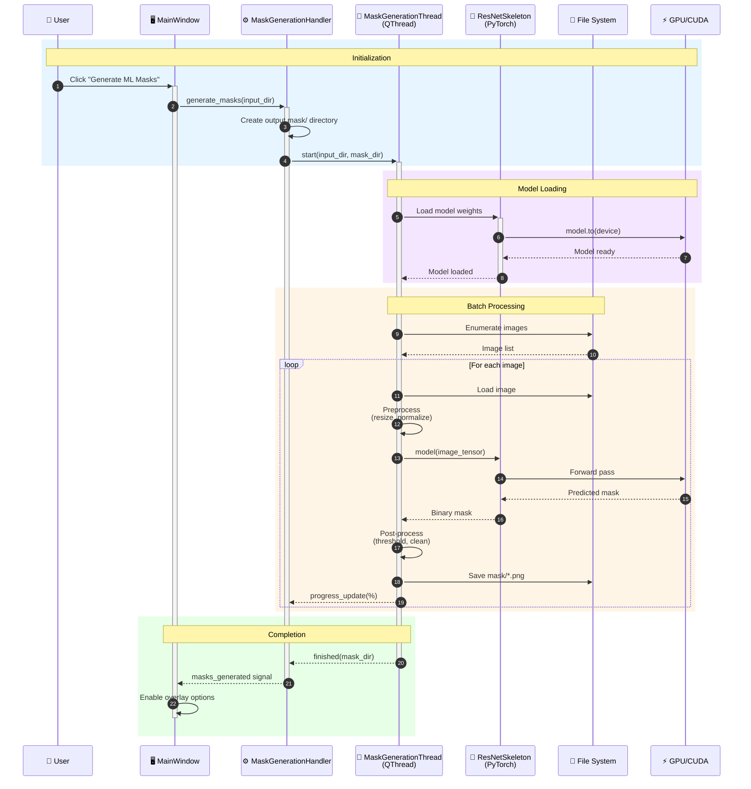
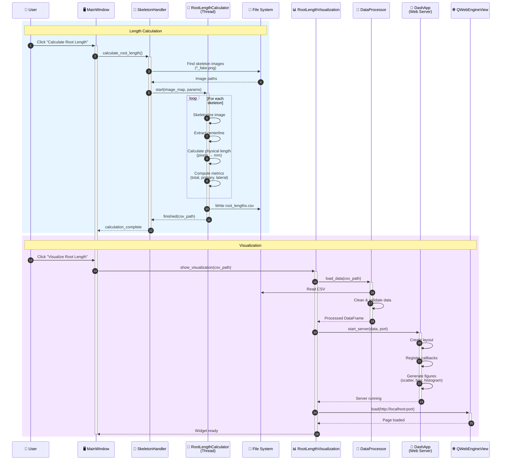
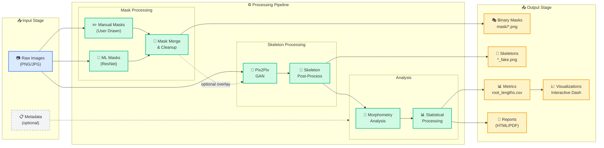
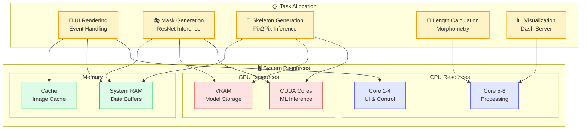

# 🌱 Root-Mask-and-Skeletons — System Architecture

## 📋 Executive Summary

The Root-Mask-and-Skeletons application is a comprehensive PyQt6-based system for automated root analysis in plant science. It combines computer vision, deep learning, and interactive visualization to process root images, generate segmentation masks, extract skeletal structures, and compute morphological metrics.

### Key Capabilities
- **🎨 Interactive Mask Editing**: Manual tracing and editing tools for precise segmentation
- **🤖 ML-Powered Processing**: Dual-model architecture using ResNet for masks and Pix2Pix for skeletons
- **📊 Advanced Analytics**: Automatic root length calculation and morphometric analysis
- **📈 Rich Visualizations**: Interactive dashboards with Plotly Dash integration
- **⚡ Hardware Optimization**: Intelligent GPU/CPU resource management

---

## 🏗️ System Architecture Overview

### Unified Functional Architecture



---

## 🌐 System Context & External Interfaces

```mermaid
flowchart LR
    %% Styling
    classDef external fill:#f0f9ff,stroke:#0284c7,stroke-width:2px
    classDef internal fill:#f0fdf4,stroke:#16a34a,stroke-width:2px
    classDef hardware fill:#fef3c7,stroke:#f59e0b,stroke-width:2px
    classDef model fill:#fce7f3,stroke:#ec4899,stroke-width:2px

    %% External Actors
    subgraph EXT["External Interfaces"]
        user([👤 User]):::external
        fs[("💾 File System<br/>Local Storage")]:::external
        gpu["⚡ GPU/CPU<br/>Hardware")]:::hardware
    end

    %% Core Application
    subgraph APP["Root Analysis Application"]
        gui["🖥️ PyQt6 GUI<br/>`main.py`<br/>`main_window.py`"]:::internal
        
        subgraph MODELS["ML Models"]
            pix2pix["🎨 Pix2Pix GAN<br/>`pix2pix_inference_script.py`<br/>Enhanced ResNet"]:::model
            resnet["🔍 Mask Model<br/>`mask_model/model.py`<br/>ResNetSkeleton"]:::model
        end
        
        dash["📊 Dash Server<br/>`root_length_visulization.py`<br/>`dash_app.py`"]:::internal
    end

    %% Connections
    user ==> gui
    gui <==> fs
    gui <==> dash
    gui --> pix2pix
    gui --> resnet
    pix2pix <==> fs
    resnet <==> fs
    dash <==> fs
    pix2pix -.-> gpu
    resnet -.-> gpu
```

---

## 🔌 Component Architecture & Module Dependencies



---

## 🔄 Operational Workflows

### 🦴 Skeleton Generation Workflow (Pix2Pix GAN)



### 🎭 Mask Generation Workflow (ResNet CNN)



### 📏 Root Length Calculation & Visualization



---

## 🔀 Data Flow Architecture



---

## 💻 Hardware Resource Management



---

## 📁 File Structure & Artifacts

### Directory Structure

```
root-mask-and-skeletons/
│
├── 📱 GUI Components
│   ├── main.py                          # Application entry point
│   ├── main_window.py                   # Main window controller
│   ├── display_controller.py            # Image display management
│   ├── mask_tracing_interface.py        # Manual annotation tools
│   └── image_manager.py                 # File management
│
├── ⚙️ Handlers
│   ├── skeleton_handler.py              # Skeleton operations coordinator
│   ├── mask_generation_handler.py       # Mask generation coordinator
│   ├── generate_skeleton_handler.py     # Pix2Pix subprocess manager
│   └── root_length_inference_handler.py # Morphometry calculator
│
├── 🤖 ML Models
│   ├── mask_model/
│   │   └── model.py                     # ResNetSkeleton implementation
│   ├── models/                          # Pix2Pix network definitions
│   ├── data/                            # Dataset loaders
│   └── util/                            # Utility functions
│
├── 📊 Visualization
│   ├── root_length_visulization.py      # Qt-Dash integration
│   ├── dash_app.py                      # Dash application
│   └── data_processor.py                # Data processing pipeline
│
└── 📤 Output Artifacts
    ├── mask/                             # Generated binary masks
    ├── output/skeletonizer/              # Pix2Pix results
    │   └── test_latest/
    │       ├── images/*_fake.png        # Skeleton images
    │       └── index.html                # Results viewer
    └── root_lengths.csv                  # Computed metrics
```

### Runtime Artifacts

| Artifact Type | Location | Format | Description |
|--------------|----------|--------|-------------|
| **Input Images** | User specified | PNG/JPG | Original root images |
| **Binary Masks** | `mask/*.png` | 8-bit PNG | Segmentation masks |
| **Skeleton Images** | `*_fake.png` | RGB PNG | Skeletonized roots |
| **Metrics CSV** | `root_lengths.csv` | CSV | Morphometric data |
| **HTML Reports** | `index.html` | HTML | Visual results browser |
| **Dash Server** | `localhost:8050` | Web | Interactive dashboard |

---

## 🔧 Configuration & Dependencies

### System Requirements

#### Minimum Requirements
- **OS**: Windows 10/11, Ubuntu 20.04+, macOS 11+
- **CPU**: Intel i5 or AMD Ryzen 5 (4+ cores)
- **RAM**: 8 GB
- **GPU**: NVIDIA GTX 1060 (6GB VRAM) for ML acceleration
- **Storage**: 10 GB available space
- **Python**: 3.8+

#### Recommended Requirements
- **CPU**: Intel i7/i9 or AMD Ryzen 7/9 (8+ cores)
- **RAM**: 16-32 GB
- **GPU**: NVIDIA RTX 3060 or better (8+ GB VRAM)
- **Storage**: 50 GB SSD

### Key Dependencies

```python
# Core Framework
PyQt6>=6.4.0          # GUI framework
numpy>=1.21.0         # Numerical computing
opencv-python>=4.6.0  # Image processing
scikit-image>=0.19.0  # Advanced image processing

# Machine Learning
torch>=1.13.0         # Deep learning framework
torchvision>=0.14.0   # Computer vision models
cuda-toolkit>=11.7    # GPU acceleration (optional)

# Visualization
plotly>=5.11.0        # Interactive plots
dash>=2.7.0           # Web dashboards
pandas>=1.5.0         # Data manipulation

# Web Integration
PyQtWebEngine>=6.4.0  # Web content display
flask>=2.2.0          # Web server (for Dash)
```

---

## 🚀 Performance Optimization Strategies

### GPU Utilization
- **Model Persistence**: ResNet model loaded once and kept in memory
- **Batch Processing**: Process multiple images in single GPU transfer
- **Mixed Precision**: FP16 computation where supported
- **Memory Management**: Automatic VRAM cleanup after subprocess completion

### CPU Optimization
- **Multithreading**: Separate threads for UI, processing, and visualization
- **Async Operations**: Non-blocking file I/O and network requests
- **Cache Strategy**: LRU cache for frequently accessed images
- **Lazy Loading**: Load data only when needed

### Memory Management
- **Image Pyramids**: Multi-resolution representation for large images
- **Streaming Processing**: Process large datasets in chunks
- **Garbage Collection**: Explicit cleanup after major operations
- **Resource Pooling**: Reuse objects and buffers where possible

---

## 📚 API Reference

### Core Classes

#### MainWindow
```python
class MainWindow(QMainWindow):
    """Main application window coordinating all operations"""
    
    def load_folder(self, folder_path: str) -> None:
        """Load images from specified folder"""
    
    def generate_masks(self) -> None:
        """Trigger ML mask generation"""
    
    def generate_skeletons(self) -> None:
        """Trigger Pix2Pix skeleton generation"""
    
    def calculate_root_length(self) -> None:
        """Compute morphometric measurements"""
    
    def visualize_results(self) -> None:
        """Launch interactive dashboard"""
```

#### ImageManager
```python
class ImageManager:
    """Manages image loading and caching"""
    
    def load_images(self, directory: str) -> List[str]:
        """Load all images from directory"""
    
    def get_processed_path(self, image_name: str) -> Optional[str]:
        """Get path to processed version of image"""
    
    def cache_image(self, path: str, image: np.ndarray) -> None:
        """Cache image in memory"""
```

#### MaskGenerationHandler
```python
class MaskGenerationHandler(QObject):
    """Coordinates mask generation using ResNet model"""
    
    finished = pyqtSignal(str)  # Emits output directory
    progress = pyqtSignal(int)  # Emits progress percentage
    
    def generate_masks(self, input_dir: str, output_dir: str) -> None:
        """Generate masks for all images in input directory"""
```

---

## 🔒 Security & Error Handling

### Security Measures
- **Input Validation**: Sanitize file paths and user inputs
- **Sandboxing**: Run inference in isolated subprocesses
- **Resource Limits**: Prevent memory exhaustion with limits
- **Access Control**: Restrict file system access to designated directories

### Error Handling
- **Graceful Degradation**: Fall back to CPU if GPU unavailable
- **Recovery Mechanisms**: Auto-save and recovery for long operations
- **User Feedback**: Clear error messages and suggested actions

---

## 📈 Future Enhancements

### Planned Features
- 🌐 **Cloud Processing**: Distributed processing for large datasets
- 🤝 **Collaboration Tools**: Multi-user annotation and review
- 📱 **Mobile Support**: Companion mobile app for field data collection
- 🧪 **Extended Metrics**: Additional morphological measurements
- 🔄 **Real-time Processing**: Stream processing for video input
- 🎯 **Custom Models**: User-trainable models for specific root types

### Technical Roadmap
1. **Q1 2025**: Implement distributed processing architecture
2. **Q2 2025**: Add real-time collaboration features
3. **Q3 2025**: Release mobile companion app
4. **Q4 2025**: Deploy cloud-based processing service

---

## 📞 Support & Documentation

- **Documentation**: Comprehensive user and developer guides
- **API Reference**: Detailed API documentation with examples
- **Tutorials**: Step-by-step guides for common workflows
- **Community Forum**: Active user community for support
- **Issue Tracker**: GitHub issues for bug reports and features
- **Contact**: support@rootanalysis.org

---

*Last Updated: September 2025*
*Version: 2.0.0*
*Architecture Document Revision: 3.1*